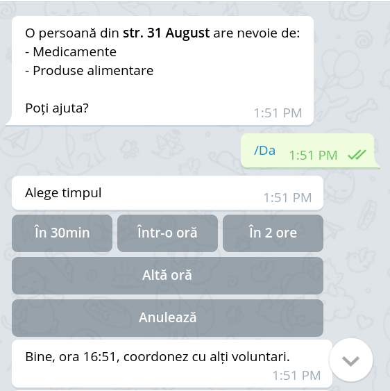
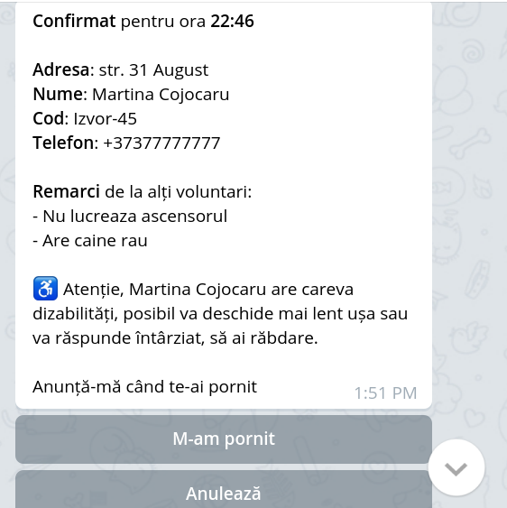

# Telegram bot that connects volunteers to beneficiaries who need assistance during the COVID-19 pandemic

- See `doc/chat_interaction.svg` to get an idea of the workflow
- Code derived from https://github.com/roataway/telegram-bot, it provides examples of stateful interactions

The aim of the bot is to disseminate details about assistance requests to volunteers who happen to be nearby. The bot
notifies them via Telegram, then volunteers either decline the request or state the time when they will be able to
handle it. The backend examines the received offers and assigns one volunteer to the mission. The bot then informs the
volunteer about the address and the needs of the person who needs assistance. At the end of the interaction the bot's
interface provides means to collect details about the beneficiary's mood and symptoms, as well as additional
remarks for future volunteers who might deal with this person.

{:height="50%" width="50%"}

<!-- .element height="50%" width="50%" -->


## The big picture

```
                                                                          (start here)

                                                                      +--------------------+
                                                                      |    pool of fixers  |
                                                                      |  F1, F2, .. Fn     |
                                                                      +--+-----------------+
                                                                         |
                                                                         |  the fixer uses the UI to
                                                                         |  add new help requests
                                                                         |  to the system
+--------------+          +--------------------------------+             |
|              |  notify  |                                |         +---v---------------+
|   pool of    |  and     |   +-----------------+          +         |    frontend       |
|   volunteers |  interact|   |   Telegram bot  |     feedack via    |                   |
|              <-------------->                 |     REST API       +-------------------+
|   Vol_1      |          |   |                 +----------+----+             |new
|   Vol_2      |          |   +-----^-----------+          |    |             |request
|   ..         |          |         |                      |    |    +--------v----------+
|   Vol_n      |          |         |  notify              +    +---->     backend       |
|              |          |         |                notify bot      |                   |
|              |          |   +-----+-----------+    about a new  +--+                   |
+--------------+          |   |   REST API      |    help request |  +-------------------+
                          |   |                 <----------+------+
                          |   |                 |          |
                          |   +-----------------+          |
                          |                                |
                          |                                |
                          |                 (this repo)    |
                          +--------------------------------+

```

Legend:

- `backend` - a running instance of https://github.com/code4moldova/covid19md-voluntari-server
- `REST API` is invoked by the backend to notify the bot about new requests for assistance. This eliminates the need for
the bot to continuously poll the backend for new requests.

## Endpoints

The following endpoints are used for interaction between the backend and the Telegram bot:

    [done] backend->bot: notify bot about a new request for assistance
    [done] backend->bot: notify the specific volunteer that they are responsible for a request
    [done] backend->bot: notify the specific volunteer that a request assigned to them was cancelled}
    [done] bot->backend: notify about offers from volunteers about a specific requestID
    [done] bot->backend: volunteer is on their way
    [done] bot->backend: mission accomplished
    [done] bot->backend: send the receipt
    [done] bot->backend: exit survey
    - bot->backend: registration data about a new volunteer
    
    
## Payloads

Payload sample `assistance_request`, this is sent when a new request is added to the system by a fixer.

    {
        "request_id": "fe91e4b6-e902-4d03-8500-d058673cb9bd",
        "beneficiary": "Martina Cojocaru",
        "address": "str. 31 August",
        "needs": ["Medicamente", "Produse alimentare"],
        "gotSymptoms": false,
        "hasDisabilities": false,
        "safetyCode": "Izvor-45",
        "phoneNumber": "+373 777 77 777",
        "remarks": ["Nu lucreaza ascensorul", "Are caine rau"],
        "volunteers": [chat_id1, chat_id2, chat_idN]
        "latitude": 47.0255165,
        "longitude": 28.8303149
      }

Payload sample `assign_assistance`, this is sent when the system decided which volunteer to dispatch to a beneficiary.

    {
        "request_id": "fe91e4b6-e902-4d03-8500-d058673cb9bd",
        "volunteer": chat_id,
        "time": "20:45"  # note that this time **must** be in UTC
    }

Payload sample `cancel_help_request`, this is sent when a fixer notifies a volunteer that the request to assist has been cancelled.

    {
          "request_id": "fe91e4b6-e902-4d03-8500-d058673cb9bd",
          "volunteer": chat_id
    }
    
Payload sample `register_pending_volunteer`, this is sent when a volunteer registered in the system via the bot. In the
process we've collected some details about them and are informing the backend about it. A fixer should then verify this
volunteer's application and approve or decline it.

     {
         'first_name', 'Alexei',
         'last_name', 'Murzicescu',
         'availability', '8',  # how many hours per day they can dedicate to the cause
         'activities', ['transport', 'delivery', 'phone'],  # at least one of these will be present
         'phone', '+3730000000'
         'chat_id' 12312323  # telegram chat id
     }

## Bot's state
Some information is stored in a persistent context that survives bot restarts. This information is needed to keep track
of entities throughout their lifecycle. The state is a dictionary, you can examine it via http://localhost:5001/introspect.
It comes in handy during debugging, but keep in mind that this exposes details about beneficiaries, so this endpoint
**must not** be accessible to the public (it is not, by default).

### User related

- `state` - `{EXPECTING_PHONE_NUMBER, ONBOARD_COMPLETE ...}`.
- `reviewed_request` - a string with the ID of the request that the volunteer considers taking.
- `current_request` - a string with the ID of the request that is currently handled by this user. Can be `None` if no
request is currently handled.
- `amount` - the amount paid in the context of a request (can be `None` if no expenses were incurred).
- `wellbeing` - an interger between 0 (very bad) and 4 (very good), corresponding to the perceived state of the
beneficiary's health (assessed by the volunteer), see `keyboards.py/wellbeing_choices` for details.


## How to run it

1. Talk to @BotFather to register your bot and get a token, as described here: https://core.telegram.org/bots#6-botfather
2. Install dependencies from `requirements.txt` using `virtualenv` or `pipenv`
3. Set the `TELEGRAM_TOKEN` environment variable to the token, e.g. `export TELEGRAM_TOKEN=1123test`
4. Set the environment variables for connecting to the backend: `COVID_BACKEND` (e.g. `http://127.0.0.1:5000/api/`),
`COVID_BACKEND_USER`, `COVID_BACKEND_PASS`
5. Run `python main.py`

ptionally, you can open http://localhost:5001 to send an example of a payload, simulating an actual request that came
from the backend.


# How to contribute

1. Run ``make autoformat`` to format all ``.py`` files
2. Run ``make verify`` and examine the output, looking for issues that need to be addressed
3. Open a pull request with your changes

To avoid time-related confusions, set `constants.py/TIMEZONE` to your timezone. The logs will explicitly say
the time is in UTC, and also display a user-centric timestamp, to remind you about this. Nevertheless, you
should keep this in mind at all times.


# How to use the Docker image

1. Build it first: `docker build -t covid-tg-bot .`. Run `docker images` to ensure it is in the list.
2. Run it with: `docker run --rm -it -p 5001:5001 -v /path/to/folder:/app -e TELEGRAM_TOKEN='----replace-token-here' -e COVID_BACKEND=http://127.0.0.1:5000/ e COVID_BACKEND_USER=admin e COVID_BACKEND_PASS=secret covid-tg-bot` (adjust to
taste, for example you might want to remove `--rm`)
